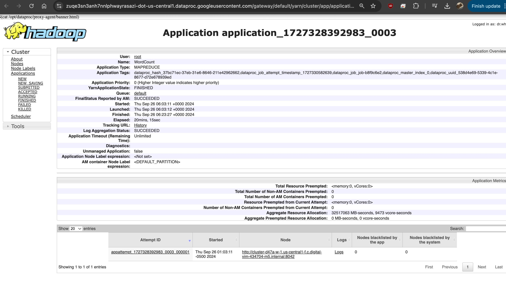
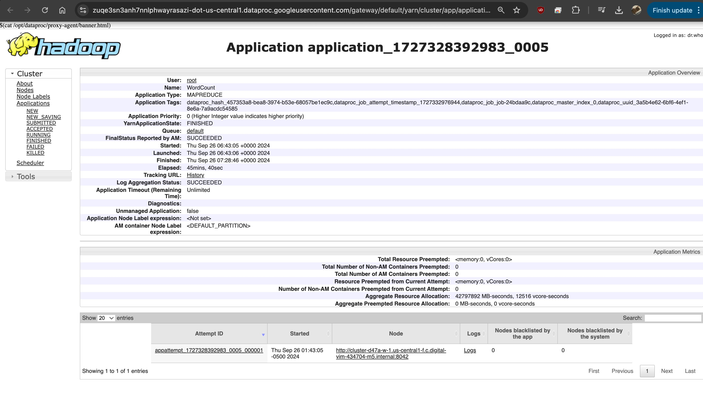
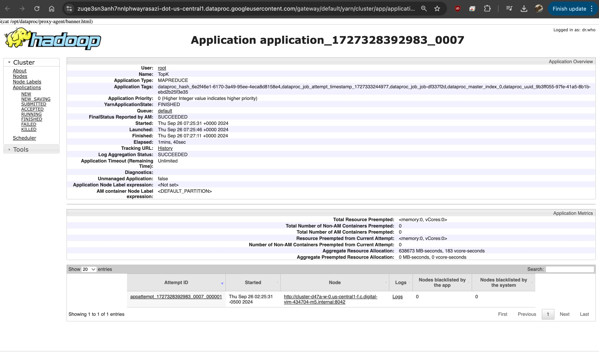
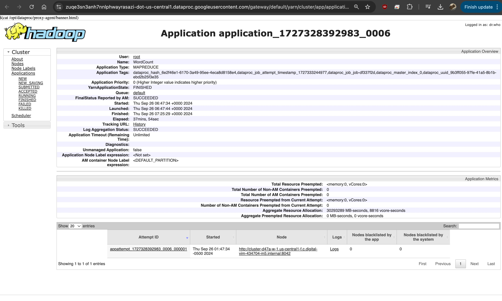
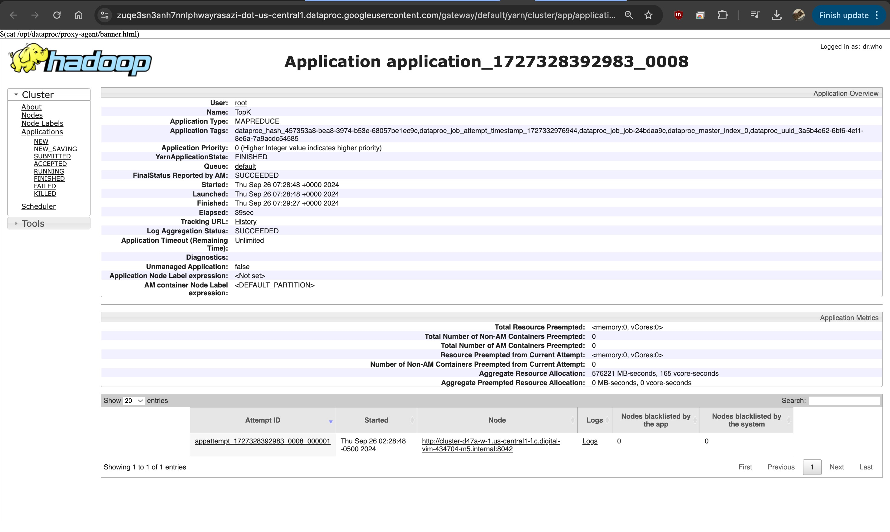
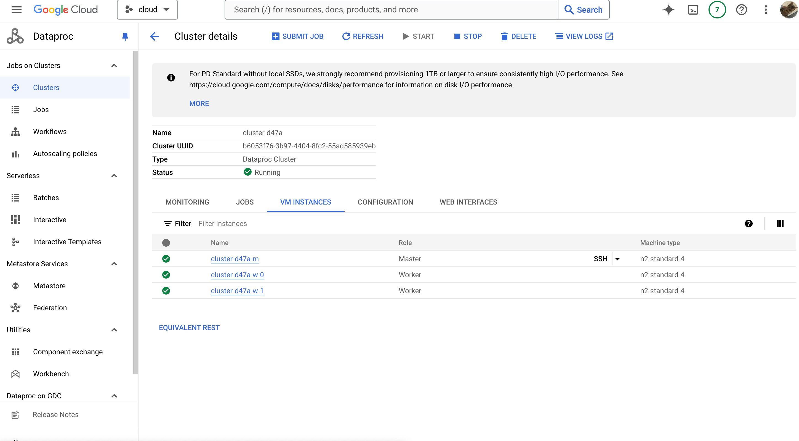
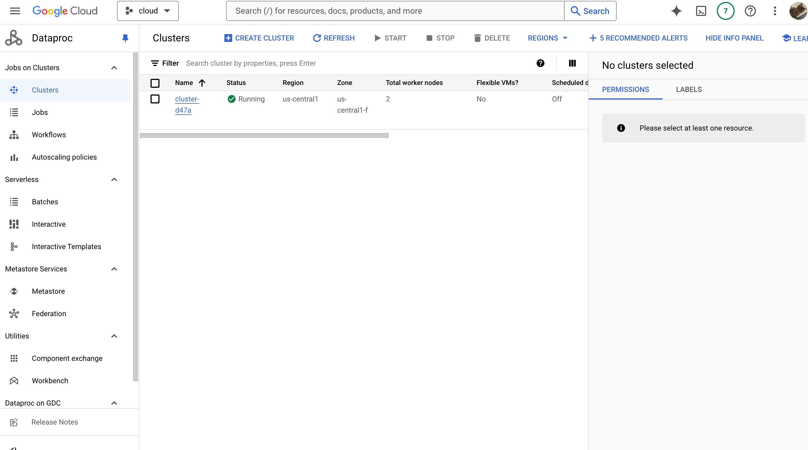

# Please add your team members' names here.

## Team members' names

1. Student Name: Jeremy Nguyen

    Student UT EID: jn28548

2. Student Name: Josh Yu

    Student UT EID: jty357

3. Student Name: Surain Saigal

    Student UT EID: ss95785

4. Student Name: Tyler Kubecka

    Student UT EID: tak2433

...

## Course Name: CS378 - Cloud Computing

## Unique Number: 51515

# Add your Project REPORT HERE

## Task 1:
1    176034
2    135707
3    105483
4    81793
5    66399
6    120843
7    196900
8    237385
9    248158
10    241746
11    248155
12    263908
13    263400
14    276676
15    275808
16    243366
17    272205
18    330998
19    344810
20    323274
21    319138
22    309073
23    276814
24    227370

## YARN HISTORY TASK 1:

## Task 2:
00DC83118CA675B9A2876C35E3398AF5    1.0
0219EB9A4C74AAA118104359E5A5914C    1.0
022B8DF4D6D7C4DCF11233DD74C9E189    1.0
02510B3B0E797E51AF73361185F62D0B    1.0
FF96A951C04FBCEDE5BCB473CF5CBDBF    1.0

## YARN HISTORY TASK 2:

## Task 3:
FD2AE1C5F9F5FBE73A6D6D3D33270571    4095.0
A7C9E60EEE31E4ADC387392D37CD06B8    1260.0
D8E90D724DBD98495C1F41D125ED029A    630.0
E9DA1D289A7E321CC179C51C0C526A73    231.3
95A921A9908727D4DC03B5D25A4B0F62    210.0
74071A673307CA7459BCF75FBD024E09    210.0
42AB6BEE456B102C1CF8D9D8E71E845A    191.55
28EAF0C54680C6998F0F2196F2DA2E21    180.0
FA587EC2731AAB9F2952622E89088D4B    180.0
E79402C516CEF1A6BB6F526A142597D4    144.55

## YARN HISTORY TASK 3:

# Google Cluster Screenshot

# Project Template

# Running on Laptop

Prerequisite:

-   Maven 3

-   JDK 1.6 or higher

-   (If working with eclipse) Eclipse with m2eclipse plugin installed

The java main class is:

edu.cs.utexas.HadoopEx.WordCount

Input file: Book-Tiny.txt

Specify your own Output directory like

# Running:

## Create a JAR Using Maven

To compile the project and create a single jar file with all dependencies:
`	mvn clean package `

## Run your application

Inside your shell with Hadoop

Running as Java Application:

`java -jar target/MapReduce-WordCount-example-0.1-SNAPSHOT-jar-with-dependencies.jar ../taxi-data-sorted-small.csv  output`

Or has hadoop application

`hadoop jar your-hadoop-application.jar edu.cs.utexas.HadoopEx.WordCount arg0 arg1 ... `

## Create a single JAR File from eclipse

Create a single gar file with eclipse

-   File export -> export -> export as binary -> "Extract generated libraries into generated JAR"
